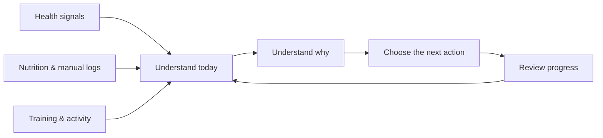
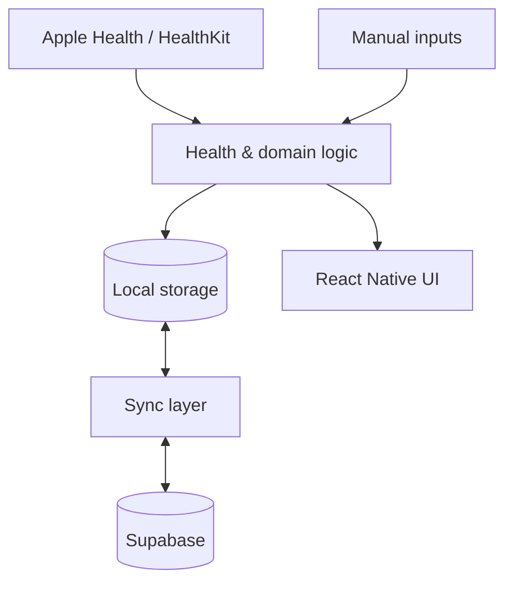

# حالتي

### Arabic-first personal health platform for iOS

**Sleep · Recovery · Strain · Nutrition · Training · Progress — brought together in one daily experience**

`Pre-launch` · `React Native / Expo` · `HealthKit` · `Supabase` · `Arabic / English`

---

## Overview

**حالتي** is a personal health application designed to bring several daily health workflows into one place instead of making the user move between separate apps for sleep, recovery, nutrition, training and progress.

The product is built around three simple questions:

> **How am I today? Why? What should I do next?**

This repository is a public **product showcase and case study** for the current pre-launch build. The active application source remains private while the project is still under development.

---

## Product preview

  
  &nbsp;&nbsp;
  
  &nbsp;&nbsp;
  

Selected screens from the current Arabic-first pre-launch build.

---

## The product problem

Health data is often fragmented. A user may check sleep and recovery in one app, log food in another, track workouts somewhere else, and then interpret progress manually.

حالتي explores a more connected experience: each area remains useful on its own, while the overall product helps the user understand the day as one picture.

### Core product loop

---

## My role

My main contribution to حالتي is in **product analysis, product direction and user experience**.

I worked on areas such as:

- defining and refining product requirements;
- breaking broad ideas into practical user flows;
- reviewing screens and identifying usability or functional gaps;
- simplifying repeated workflows such as food and workout logging;
- deciding what belongs on the main screen versus deeper analysis pages;
- comparing product approaches and prioritizing improvements;
- testing the application and iterating on issues found in real use;
- shaping Arabic-first navigation, hierarchy and terminology;
- coordinating product decisions across health, nutrition, training and progress features.

The project has also been developed with extensive **AI-assisted coding**. My strongest hands-on area is the product, requirements and front-end experience; the technical documentation is included to explain how the current application is structured, not to present me as a specialist backend engineer.

---

## Core product areas

| Area | Purpose |
| --- | --- |
| **Today** | turn multiple signals into one understandable daily state |
| **Sleep** | show sleep quality, duration, consistency and deeper sleep context |
| **Recovery** | interpret HRV, resting heart rate, sleep and recent load against personal history |
| **Strain** | represent accumulated physical load separately from recovery |
| **Nutrition** | make food logging faster through search, barcode, saved meals and quick repeat actions |
| **Training** | connect plans, sessions, progression and muscle-recovery context |
| **Body & Progress** | track weight, body composition, goals and longer-term changes |
| **Timeline & Reports** | connect planned activities with what actually happened and show trends over time |
| **Friends / Coaching** | support controlled sharing and contextual guidance |

---

## Product / UX approach

A recurring design rule is:

> **Keep the daily surface simple; place depth behind drill-down.**

| Level | User question | Experience |
| --- | --- | --- |
| **1** | How am I? | headline state and the most relevant next step |
| **2** | Why? | contributing measurements and context |
| **3** | What changed? | history, trends and deeper analysis |

This structure is used across sleep, recovery, strain, nutrition and training so the product can serve both quick daily use and users who want more detail.

For more detail, see **[Product & UX Design →](docs/PRODUCT-DESIGN.md)**.

---

## Selected technical context

The current application uses:

- **React Native / Expo** for the mobile application;
- **HealthKit** for supported Apple Health signals;
- **MMKV** for local-first persistence;
- **Supabase** for authentication, database and cloud synchronization;
- **TypeScript** across the application;
- an Arabic/English interface with RTL/LTR support.

At a high level, the application separates health-data ingestion, domain logic, local storage, synchronization and presentation rather than keeping everything inside screen components.

Technical documentation is available for reviewers who want additional detail:

| Topic | Document |
| --- | --- |
| Product and UX decisions | [Product & UX Design](docs/PRODUCT-DESIGN.md) |
| Application structure | [System Architecture](docs/ARCHITECTURE.md) |
| Backend and data model | [Backend & Data](docs/BACKEND-AND-DATA.md) |
| Selected scoring logic | [Core Algorithms](docs/CORE-ALGORITHMS.md) |
| Testing and quality checks | [Quality & Testing](docs/QUALITY-AND-TESTING.md) |
| High-level project structure | [Project Map](docs/PROJECT-MAP.md) |

---

## Current state

حالتي is an **active pre-launch personal project**. The current build includes working and evolving experiences across daily health, sleep, recovery, strain, nutrition, training, progress, reports, onboarding and Apple Health integration.

Some areas are more mature than others. The current focus is improving consistency, data reliability and the experience of moving between the different health domains as one product.

---

<strong>View current-build screenshot gallery</strong>

 

  
  
  

  
  
  

  
  
  

  
  
  

