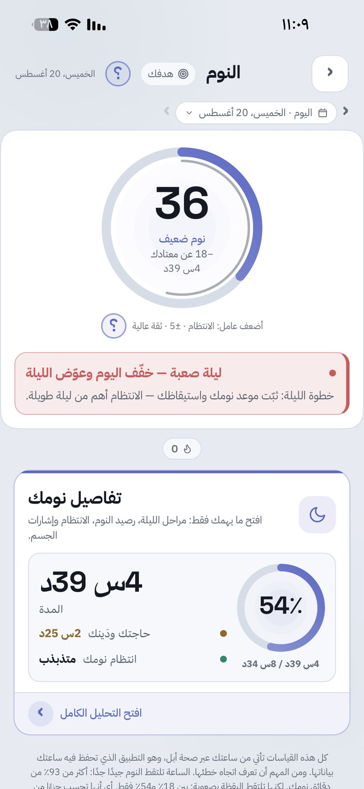
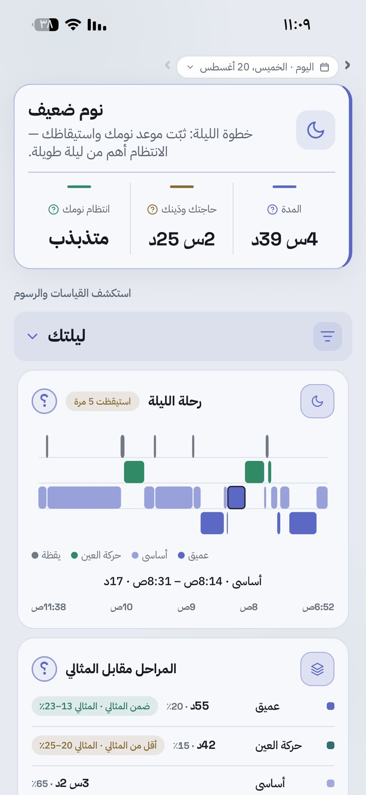
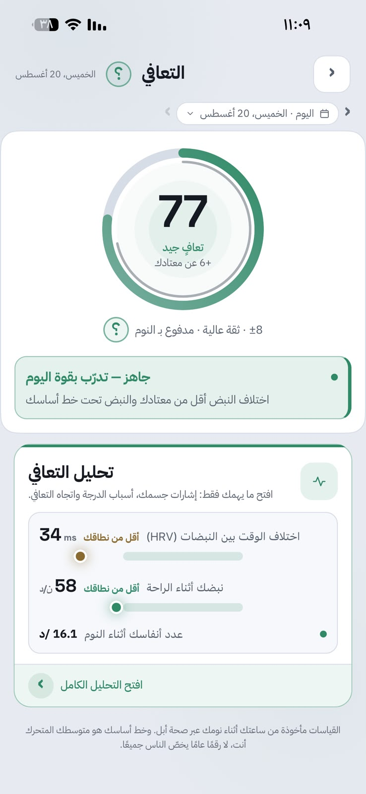
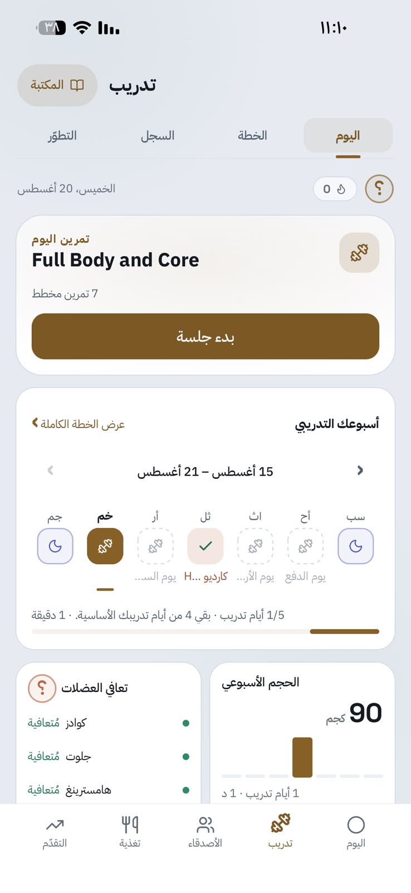
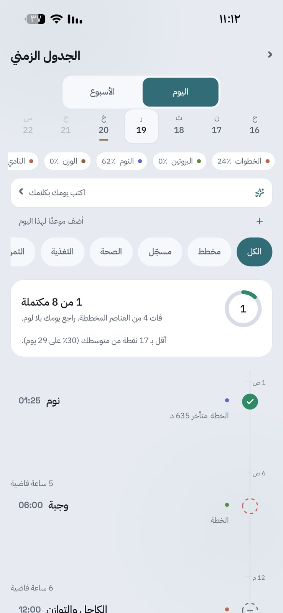
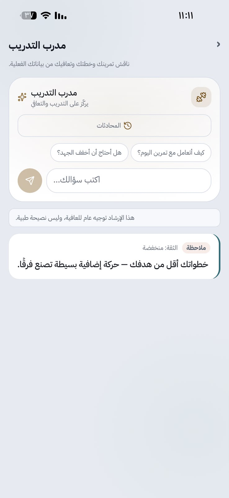
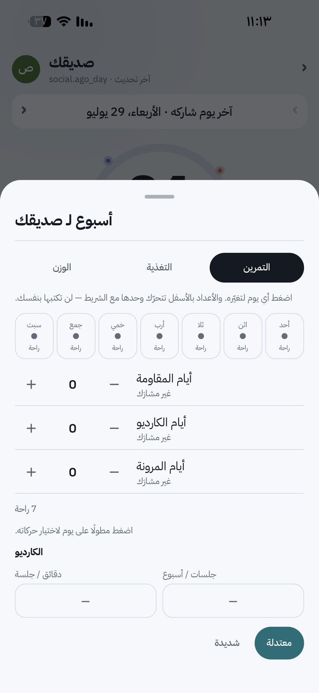
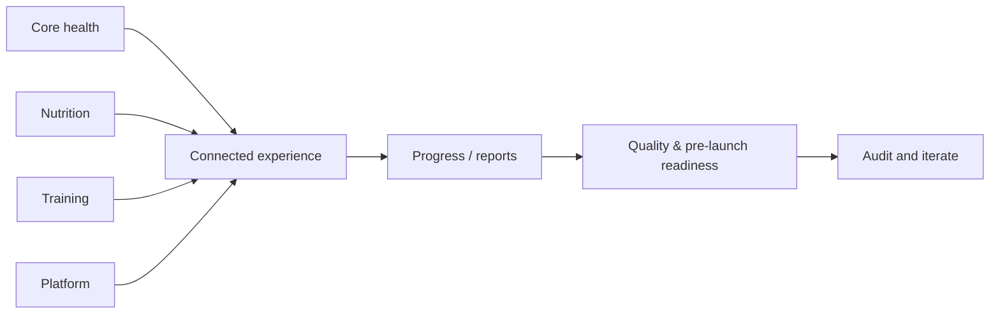
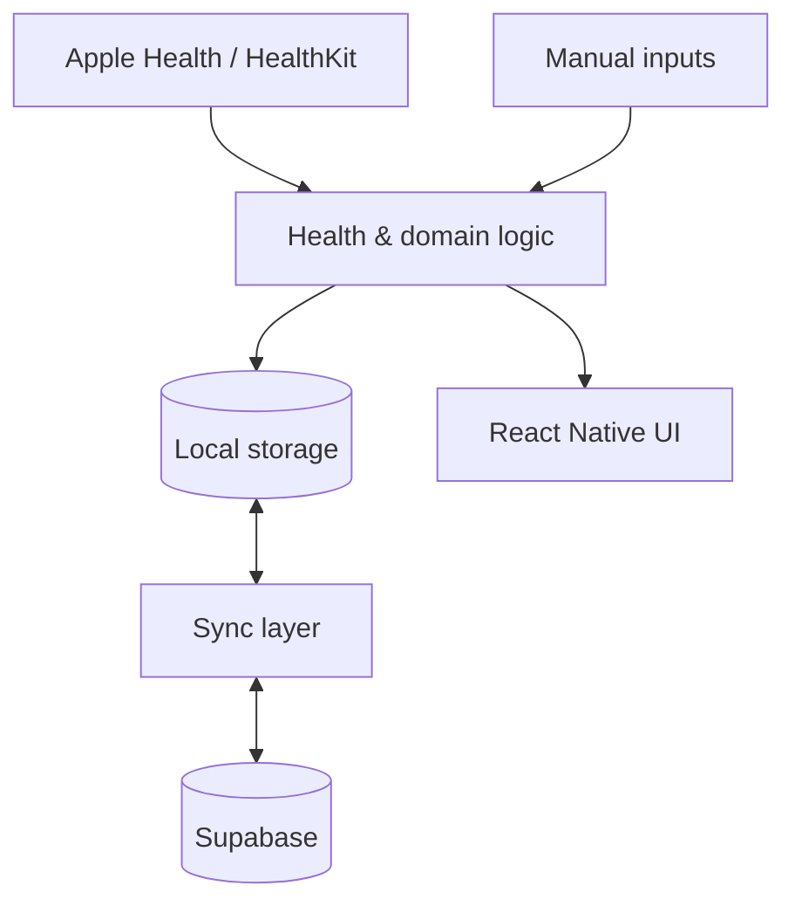

<div align="center">


# حالتي

### Your health day, all in one place

**Sleep · Recovery · Daily Load · Nutrition · Training · Progress — one connected experience**

`Pre-launch` · `iOS` · `React Native / Expo` · `HealthKit` · `Supabase`

</div>

---

## The product idea

Health tracking is often fragmented: sleep and recovery in one place, nutrition in another, workouts somewhere else, and progress tracked separately.

**حالتي** brings those parts into one place, giving the user a **clearer view of their health day** without having to piece the story together across separate trackers.

The experience is organized around three practical questions:

> **How am I today? What is driving that state? What should I do next?**

If the user chooses to share selected information, the same structure can also make follow-up easier for a **coach or trainer** — so training, recovery, nutrition, and progress can be reviewed in context rather than as isolated updates.

This repository is a public **product portfolio and case study** for the current pre-launch build.

**My direct focus:** requirements, prioritization, UX review, testing, product decisions, and evaluating the implemented experience.

<p align="center">
  
</p>
<p align="center"><sub><b>Today</b> — the main entry point brings the user's health day together before deeper exploration.</sub></p>

---

## How the experience connects the day

The product is not designed as a collection of unrelated mini-apps. Each area answers a different part of the same daily health story.

### Sleep

Sleep starts with a clear headline state, then lets the user inspect duration, consistency, sleep need, stages, interruptions, history, and methodology when more detail is useful.

<p align="center">
  
  &nbsp;&nbsp;
  
</p>
<p align="center"><sub><b>Overview</b> for a fast read · <b>Detail</b> for deeper sleep context.</sub></p>

### Recovery

Recovery interprets signals such as HRV, resting heart rate, sleep, and recent load against the user's own history. The goal is not only to show a score, but to explain **why the user is in that state today**.

<p align="center">
  
  &nbsp;&nbsp;
  
</p>
<p align="center"><sub><b>Recovery state</b> first · supporting signals and explanation when the user wants to understand why.</sub></p>

### Nutrition

Nutrition is designed around a high-frequency task: logging food without turning every meal into a long transaction. Search, serving size × quantity, quick/recent/saved logging, barcode support, and immediate daily totals are treated as one connected flow.

<p align="center">
  
</p>

The requirement analysis behind this flow is documented in the **[Nutrition Logging Case Study →](docs/BUSINESS-ANALYSIS-CASE-STUDY.md)**.

### Training

Training connects plans, today's session, set logging, progression, and muscle-recovery context. It is intentionally connected back to recovery rather than behaving as a completely separate workout tracker.

<p align="center">
  
  &nbsp;&nbsp;
  
</p>
<p align="center"><sub>Training execution and muscle-recovery context are designed as parts of the same decision loop.</sub></p>

### Progress & timeline

The timeline connects what was planned with what actually happened, while body composition and longer-term views help the user follow change beyond a single day.

<p align="center">
  
  &nbsp;&nbsp;
  
</p>

### Coaching & controlled follow-up

When the user chooses to share relevant information, the product can support a more practical coach/trainer workflow rather than relying on scattered screenshots and messages. The design includes training-focused follow-up and the ability to manage workout context for shared profiles.

<p align="center">
  
  &nbsp;&nbsp;
  
</p>
<p align="center"><sub>Selected sharing is permission-aware; the goal is useful follow-up, not making health data public by default.</sub></p>

---

## Project evidence

This repository documents not only what the application contains, but also how problems were analyzed, decisions were made, and work was organized.

| Area | Evidence |
| --- | --- |
| **Requirements & process analysis** | problem framing, user needs, requirements, user stories, acceptance criteria, prioritization, traceability |
| **Planning & delivery** | scope breakdown, workstreams, dependencies, risks/issues, prioritization, iterative delivery |
| **Product decisions & prioritization** | alternatives, trade-offs, feature decisions, sequencing, review and iteration |
| **Product & UX thinking** | user flows, friction reduction, information hierarchy, bilingual/RTL-aware interaction design |
| **Systems & technical context** | data flows, local/cloud boundaries, HealthKit integration, architecture documentation |
| **Testing & quality** | functional review, missing-data behavior, quality gates and release checks |

### Selected case studies and documentation

| Topic | Document |
| --- | --- |
| **Requirements & process analysis** | **[Nutrition logging case study →](docs/BUSINESS-ANALYSIS-CASE-STUDY.md)** |
| **Planning & delivery** | **[Project delivery case study →](docs/PROJECT-DELIVERY-CASE-STUDY.md)** |
| **Product decisions & trade-offs** | **[Decision case study →](docs/DECISION-CASE-STUDY.md)** |
| **Product & UX thinking** | **[Product & UX design →](docs/PRODUCT-DESIGN.md)** |
| **Systems & technical context** | **[System architecture →](docs/ARCHITECTURE.md)** |

---

## My contribution

My strongest direct contribution to حالتي is in **requirements, prioritization, UX review, testing, and keeping decisions consistent across the product**.

I have worked across the project by:

- turning broad ideas into clearer requirements and user flows;
- reviewing implemented screens and identifying usability or functional gaps;
- simplifying repeated workflows such as food and workout logging;
- deciding what belongs on a daily summary versus deeper analysis;
- comparing different product approaches before choosing an implementation direction;
- prioritizing improvements based on correctness, user value, and repeated-use friction;
- testing real flows and iterating when the result did not match the intended experience;
- reviewing Arabic/English hierarchy, terminology, and RTL/LTR behavior;
- keeping decisions consistent across health, nutrition, training, and progress areas.

The technical sections document the current implemented system. My direct hands-on focus is the **requirements, product experience, front-end review, testing, prioritization, and evaluation of the implemented result**.

---

## A concrete analysis example: nutrition logging

A feature list does not show how a requirement was reached. Nutrition logging is one example of the analysis process.

**Problem:** food logging is repeated several times a day, so unnecessary steps create friction.

**Requirement:** allow users to select a food, choose **Serving Size × Quantity**, reuse frequent items, and confirm the transaction without repeating the full search path every time.

**Product response:** search + portion workflow + quick/recent/saved logging + barcode support + immediate daily-total updates.

```text
Problem
  → User need
  → Requirement
  → Priority
  → Flow
  → Implementation
  → Review / iteration
```

The full requirement set, acceptance criteria, prioritization, traceability, and validation targets are documented in the **[nutrition logging case study](docs/BUSINESS-ANALYSIS-CASE-STUDY.md)**.

---

## Product / UX approach

A recurring design decision is:

> **Keep the daily surface simple; place depth behind drill-down.**

| Level | User question | Experience |
| --- | --- | --- |
| **1** | How am I? | headline state and the most relevant next step |
| **2** | Why? | contributing measurements and context |
| **3** | What changed? | history, trends, and deeper analysis |

This structure helps the different health areas feel connected while still supporting users who want deeper inspection.

The alternatives and trade-offs behind this choice are documented in the **[decision case study](docs/DECISION-CASE-STUDY.md)**.

---

## Planning & delivery

Because حالتي spans several connected domains, the work is organized as workstreams rather than one long feature list:



The **[project delivery case study](docs/PROJECT-DELIVERY-CASE-STUDY.md)** documents scope, priorities, dependencies, risks/issues, and an example iteration cycle.

---

## Selected technical context

The current application uses:

- **React Native / Expo** for the mobile application;
- **HealthKit** for supported Apple Health signals;
- **MMKV** for local-first persistence;
- **Supabase** for authentication, database, and cloud synchronization;
- **TypeScript** across the application;
- **Arabic and English** interfaces with RTL/LTR support.

At a high level, the application separates health-data ingestion, domain logic, local storage, synchronization, and presentation.



Additional technical documentation is available without making the main portfolio page code-heavy:

| Topic | Document |
| --- | --- |
| Product and UX decisions | [Product & UX Design](docs/PRODUCT-DESIGN.md) |
| Application structure | [System Architecture](docs/ARCHITECTURE.md) |
| Backend and data model | [Backend & Data](docs/BACKEND-AND-DATA.md) |
| Selected scoring logic | [Core Algorithms](docs/CORE-ALGORITHMS.md) |
| Testing and quality checks | [Quality & Testing](docs/QUALITY-AND-TESTING.md) |
| High-level project structure | [Project Map](docs/PROJECT-MAP.md) |

---

## Current state

حالتي is an **active independent pre-launch product**. The current build includes working and evolving experiences across daily health, sleep, recovery, daily load, nutrition, training, progress, reports, onboarding, sharing/coaching flows, and Apple Health integration.

The current focus is improving consistency, data reliability, and the experience of moving between those areas as **one coherent health-tracking product**.
