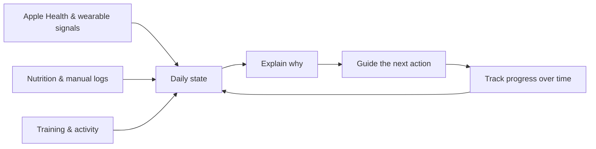
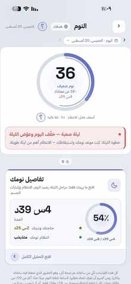

# Halaty (حالتي)

### Arabic-first personal health experience for iOS

**Sleep · Recovery · Nutrition · Training · Progress — connected into one daily experience**

`Pre-launch` · `Arabic-first` · `iOS` · `Personal Health`

> **How am I today, why, and what should I do next?**

This repository is a public showcase of the product and the work behind its experience.  
The production source code remains private.

---

## At a glance

| | |
| --- | --- |
| **Product** | Personal health & wellness application |
| **Primary audience** | Arabic-speaking users, with a Saudi/Gulf-first product direction |
| **Platform** | iOS |
| **Core experience** | Daily state, sleep, recovery, nutrition, training, progress |
| **Stage** | Active pre-launch product |
| **Public scope** | Product, UX, feature structure, decisions, and selected screenshots |
| **Private scope** | Production source code, credentials, infrastructure details, internal implementation material |

---

## Product preview

  
  &nbsp;
  
  &nbsp;
  

  <b>Today</b> — one daily state &nbsp;&nbsp; · &nbsp;&nbsp; <b>Recovery</b> — explain the signals &nbsp;&nbsp; · &nbsp;&nbsp; <b>Training</b> — turn readiness into action

> Screenshots in this showcase are from the current pre-launch iOS build.

---

## The problem

People who actively track health and fitness often split their day across several products:

- a wearable or recovery app for sleep and readiness;
- a nutrition app for food and macro tracking;
- a training app for workouts;
- separate views for body progress, trends, and goals.

That creates **more data, but not necessarily more clarity**.

Halaty explores a different product model: **sleep, recovery, nutrition, training, and progress should contribute to one understandable picture of the user's day** rather than behaving like disconnected apps under one navigation bar.

---

## The product loop

The product is designed around a recurring loop:

**Understand today → understand why → act → review progress.**

---

# Product walkthrough

## 1. Core health experience

Halaty's core health experience is designed to answer two questions quickly:

1. **What is my state today?**
2. **Why did it change?**

A top-level summary stays simple, while deeper screens expose measurements, history, and context for users who want to inspect the detail.

  
  &nbsp;&nbsp;
  

  <b>Sleep</b> — summarize the night &nbsp;&nbsp; · &nbsp;&nbsp; <b>Recovery</b> — translate signals into context

### Sleep

The sleep area separates the headline score from the deeper explanation. Users can move from a quick summary into duration, consistency, stage context, sleep debt, and longer-term interpretation.

### Recovery

Recovery combines signals such as HRV, resting heart rate, and sleep context into an understandable daily view. The interface is designed to show both the result and the reason behind it.

### Strain & load

Activity and physical load are interpreted relative to the user's own recent context. The experience aims to make a low-activity or high-load day understandable rather than treating every number as an isolated target.

---

## 2. Nutrition

Nutrition is designed as **one contributor to the daily health picture**, not a separate logging chore.

The product direction includes:

- Arabic and English food search;
- clear portions and serving quantities;
- calorie and macro targets;
- quick reuse of frequent meals;
- barcode-based product lookup;
- saved and recent meal patterns;
- reducing the number of steps required to log food.

The main UX objective is straightforward: **logging should be fast enough that the user can sustain it**, while deeper nutrition detail remains available when needed.

---

## 3. Training

Training is designed as a broader **physical-performance experience**, not only a set logger.

It includes product concepts around:

- weekly planning;
- today's suggested session;
- exercise library;
- live workout logging;
- sets, repetitions, rest, and progression;
- substitutions;
- muscle-recovery context;
- imported workout information from Apple Health / Apple Watch;
- linking training decisions back to recovery.

  

A central product goal is to avoid treating recovery and training as separate stories: **how the user recovered should matter to what training feels appropriate today.**

---

## 4. Progress & deeper insight

Daily health is more useful when users can understand what is changing over time. Halaty therefore includes product areas for:

- body weight and composition;
- personal goals and completion tracking;
- weekly and monthly reports;
- trends and historical comparisons;
- exploratory long-term indicators such as biological-age estimates;
- progress views that connect behavior with longer-term change.

The direction is to move beyond a one-day dashboard and create a **continuous story of behavior, health signals, and progress**.

---

## Supporting experiences

Beyond the four main areas, the product also explores:

| Area | Purpose |
| --- | --- |
| **Reports** | Weekly/monthly review and longer-term context |
| **Body & progress** | Weight, composition, measurements, and physical change |
| **Goals** | Daily and weekly behavior targets |
| **Friends** | Permission-controlled, read-only sharing of selected information |
| **Coaching** | Contextual AI-assisted guidance and human-coach workflows |
| **Onboarding** | Introduce the product and establish required permissions/data inputs |

---

## Experience architecture

One of the main UX rules used throughout Halaty is:

> **Depth lives behind drill-down, never on the surface.**

The experience is structured in three levels:

| Level | User question | Product behavior |
| --- | --- | --- |
| **1 — Understand today** | “How am I?” | Show the essential state quickly |
| **2 — Understand why** | “Why?” | Show the most relevant drivers and context |
| **3 — Explore deeply** | “What changed over time?” | Trends, history, advanced detail, reports |

This structure helps the same product serve both users who want a 10-second daily summary and users who want to inspect detailed health and performance information.

---

## Product principles

### Simple first, detailed when requested
The first screen should communicate the important answer before exposing the detail behind it.

### Explain, not only score
A number is more useful when the user can understand the factors behind it.

### Do not invent certainty
Missing, insufficient, or still-learning data should be communicated clearly instead of being presented as a confident-looking value.

### Connect the product areas
Sleep, recovery, nutrition, training, and progress should tell one story rather than behave like unrelated modules.

### Arabic-first, not Arabic-after
Arabic affects hierarchy, terminology, layout direction, food search, and the mental model of the product—not only translation.

### Privacy by design
Health sharing should be explicit and permission-controlled rather than automatically social.

---

## Examples of product decisions

### Information hierarchy
A recurring decision is what deserves space on the first screen versus what should move into a detail view. This keeps daily use readable without removing depth.

### Reducing friction
Nutrition and training can require many inputs. The product repeatedly evaluates what must be mandatory, what can be optional, and which steps can be removed or shortened.

### Missing-data behavior
Health products can look precise even when the underlying data is incomplete. Halaty uses learning states, missing-signal states, and confidence-aware presentation rather than filling gaps with invented certainty.

### Connecting recovery and training
Recovery is intended to be actionable. The training experience is therefore designed so that readiness and recovery context can affect how the user interprets today's training.

### Controlled social visibility
Friend-facing experiences are designed around read-only tracking and category-based permissions rather than an open social feed.

---

## My contribution

My primary hands-on contribution to Halaty is in **product direction, product analysis, and user experience**.

That includes:

- defining and refining features;
- turning large ideas into user flows and smaller product decisions;
- reviewing screens and identifying usability problems;
- simplifying flows and removing unnecessary steps;
- deciding what belongs at summary versus detail level;
- comparing competitor experiences and alternative approaches;
- prioritizing product and UX improvements;
- reviewing product behavior and identifying functional gaps;
- testing iterations and refining the experience based on observed problems;
- maintaining consistency across health, nutrition, training, progress, and social areas.

I can discuss the **product rationale, flows, feature decisions, trade-offs, and front-end experience** in detail.

---

## Technology context

The private application is an iOS-focused mobile product built in a modern **React Native / Expo** environment, integrates with **Apple Health / HealthKit**, and uses **Supabase** for cloud capabilities.

These technologies are included here as product context. This showcase is intentionally centered on the product experience and the areas I personally own and can explain.

---

## Current state

Halaty is an **active pre-launch product**.

The private codebase includes working and partially working capabilities across:

`Daily Health` · `Sleep` · `Recovery` · `Nutrition` · `Training` · `Reports` · `Body & Progress` · `Coaching` · `Friends` · `Onboarding` · `Health-data integration`

The product is still being iterated. Some areas are more mature than others, and the current product challenge is turning a broad feature set into **one coherent daily experience**.

---

## What this project demonstrates

| Area | Evidence in the project |
| --- | --- |
| **Product / Business Analysis** | Problem decomposition, feature definition, workflow thinking, prioritization, gap identification, competitor comparison, iteration |
| **Product / UX** | Information architecture, progressive disclosure, interaction simplification, consistency, beginner vs. advanced-user balance |
| **Data-oriented product thinking** | Translating health data into understandable user-facing information, source vs. derived metrics, trends, summaries, confidence-aware presentation |
| **Product ownership mindset** | Maintaining coherence across multiple domains and repeatedly refining the experience around user value |

---

## Why the source code is private

The purpose of this repository is to let recruiters, hiring managers, and collaborators understand:

- **what Halaty is;**
- **what problem it is trying to solve;**
- **how the experience is structured;**
- **what product decisions shaped it;**
- **what work I personally own and can explain.**

The production source code, credentials, infrastructure details, and sensitive internal implementation material remain private.
