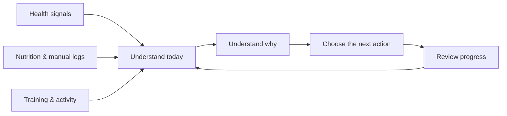
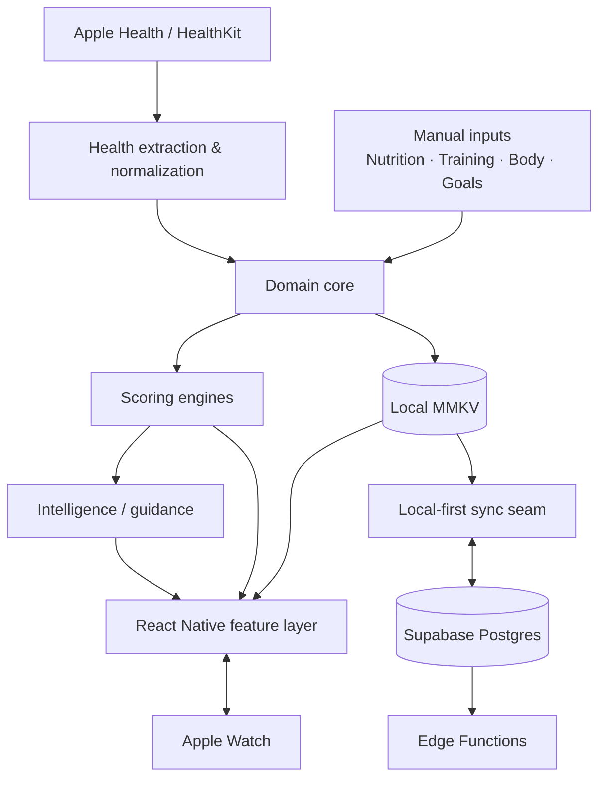
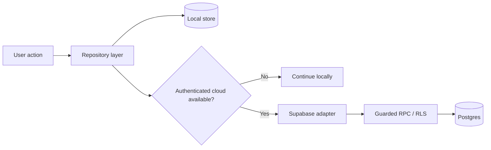

<div align="center">

# Halaty (حالتي)

### Arabic-first personal health platform for iOS

**Sleep · Recovery · Strain · Nutrition · Training · Progress — connected into one daily decision experience**

`Pre-launch` · `React Native / Expo` · `HealthKit` · `Supabase` · `Arabic / English`

> **How am I today, why, and what should I do next?**

This repository is a public **product + technical case study**.  
The production application and full source code remain private.

</div>

---

## Start here

This showcase is intentionally structured so different reviewers can inspect the part relevant to them.

| If you want to understand… | Read |
| --- | --- |
| **the product and UX thinking** | [Product & UX Design](docs/PRODUCT-DESIGN.md) |
| **how the application is structured** | [System Architecture](docs/ARCHITECTURE.md) |
| **the backend, data and Supabase model** | [Backend & Data](docs/BACKEND-AND-DATA.md) |
| **the actual scoring logic / algorithms** | [Core Algorithms](docs/CORE-ALGORITHMS.md) |
| **testing, security and release quality** | [Quality & Testing](docs/QUALITY-AND-TESTING.md) |
| **where things live in the private source tree** | [Project Map](docs/PROJECT-MAP.md) |

---

## Product in 30 seconds

Halaty is a personal health platform built around a simple problem: health-conscious users often split their day across one app for sleep/recovery, another for food, another for workouts, and separate tools for trends and body progress.

Halaty's direction is to make those domains contribute to **one understandable picture of the user's day** instead of behaving like unrelated mini-apps.

<p align="center">
  
  &nbsp;&nbsp;
  
  &nbsp;&nbsp;
  
</p>

<p align="center"><sub>Selected screens from the current Arabic-first pre-launch build. The full gallery is available near the bottom of this page.</sub></p>

### Core product loop



---

## What makes the project interesting

Halaty is not only a set of mobile screens. The private project contains several independent layers that have to agree with each other:

- **HealthKit ingestion** for sleep, HRV, resting heart rate, steps, activity and workouts.
- **Personal baseline logic** rather than treating population averages as the user's normal state.
- **Scoring engines** for sleep, recovery, strain/fatigue and related derived health states.
- **Local-first persistence** so daily interaction is not blocked by network availability.
- **Supabase cloud sync**, authentication, RLS, Edge Functions and conflict-aware writes.
- **Nutrition workflows** across search, barcode, serving quantity, saved/recent meals and multiple food-data sources.
- **Training workflows** across planning, workout logging, progression, fatigue/recovery context and Apple Watch interaction.
- **Arabic-first UX** with RTL hierarchy rather than a translation-only implementation.
- **Automated quality gates** for types, tests, routes, backend schema/RLS and release checks.

---

## System architecture



**Current implementation context:** Expo SDK 56, React Native 0.85, React 19, TypeScript, Zustand, MMKV, HealthKit, Supabase and Sentry.

For the architectural boundaries, data flow and source-tree structure, see **[System Architecture →](docs/ARCHITECTURE.md)**.

---

## Selected algorithmic depth

The production scoring implementation lives outside the UI in the private `src/core/scoring/*` domain layer.

### Sleep

```text
Sleep =
  0.30 × Duration
+ 0.30 × Consistency
+ 0.20 × Efficiency
+ 0.15 × Sleep Debt
+ 0.05 × Sleep Latency
```

The implementation also applies a **duration sufficiency gate** so severe undersleep cannot be hidden by strong secondary components.

### Recovery

```text
Recovery =
  0.40 × HRV
+ 0.25 × Resting HR
+ 0.20 × Sleep Recovery
+ 0.15 × Recent Load
```

HRV/RHR are interpreted relative to the user's own baseline rather than being ranked against another person's absolute value.

### Strain / accumulated fatigue

```text
Strain =
  0.30 × Acute:Chronic Load
+ 0.35 × Sleep Debt
+ 0.35 × HRV Suppression
```

The engine requires enough available input weight before returning a value; missing signals are not silently converted into a complete-looking score.

The public document includes selected TypeScript excerpts and explains which constants are evidence-driven versus explicit product/model choices: **[Core Algorithms →](docs/CORE-ALGORITHMS.md)**.

---

## Backend & data model

Halaty currently uses **Supabase** as its cloud backend while keeping daily interaction local-first.



Technical areas represented in the private backend include:

- typed Supabase client and generated database types;
- Auth session persistence and native PKCE flows where required;
- Row Level Security;
- version-aware guarded writes;
- deletion tombstones to reduce stale-data resurrection;
- Supabase Edge Functions for AI, USDA proxying, account deletion and shared snapshot workflows;
- privacy boundaries between raw HealthKit data and derived summaries;
- native local-store protection and fail-closed behavior.

See **[Backend & Data →](docs/BACKEND-AND-DATA.md)**.

---

## Product / UX architecture

One rule carries much of the experience:

> **Depth lives behind drill-down, never on the surface.**

| Level | User question | Experience |
| --- | --- | --- |
| **1** | How am I? | headline state and the most important action |
| **2** | Why? | drivers, relevant measurements and context |
| **3** | What changed? | history, trends, methodology and deeper analysis |

This is applied across sleep, recovery, strain, nutrition, training and progress so the product can support both quick daily use and deeper inspection.

The design document covers Arabic-first decisions, logging-flow simplification, information hierarchy, confidence/missing-data states and the iteration loop: **[Product & UX Design →](docs/PRODUCT-DESIGN.md)**.

---

## Core product areas

| Area | What it is designed to do |
| --- | --- |
| **Today** | turn multiple signals into one understandable daily state |
| **Sleep** | score the night, explain weak factors and expose deeper sleep context |
| **Recovery** | interpret HRV, RHR, prior load and sleep against personal history |
| **Strain** | represent accumulated physical cost separately from readiness |
| **Nutrition** | make food logging sustainable with fast repeat workflows and source-aware data |
| **Training** | connect plans, sessions, progression and recovery context |
| **Body & Progress** | show weight/composition/progress as a longer-term story |
| **Reports** | move from one-day metrics to week/month trend interpretation |
| **Friends / Coaching** | permission-aware sharing and contextual guidance |

---

## Engineering quality

The private repository has explicit commands/gates for:

`lint` · `typecheck` · `tests` · `timezone tests` · `runtime performance` · `route verification` · `Supabase schema checks` · `production RLS smoke` · `release gate` · `App Store checks`

The goal is that a screen rendering successfully is **not** the definition of production readiness.

See **[Quality & Testing →](docs/QUALITY-AND-TESTING.md)**.

---

## Source-tree map

A technical reviewer does not need thousands of unpublished source lines to understand how the system is divided.

The public project map shows responsibilities such as:

```text
src/core/scoring/*      health algorithms
src/core/health/*       HealthKit pipeline
src/core/nutrition/*    nutrition domain
src/core/workouts/*     training domain
src/data/supabase/*     cloud adapter
supabase/migrations/*   schema / RLS / RPCs
supabase/functions/*    privileged server operations
targets/watch/*         Apple Watch target
```

See **[Project Map →](docs/PROJECT-MAP.md)**.

---

## My role and scope

My strongest hands-on contribution is in **product direction, product analysis and user experience**:

- defining/refining features;
- breaking large ideas into user flows and product decisions;
- reviewing real screens and identifying usability/functional gaps;
- simplifying repeated workflows;
- deciding summary vs. drill-down hierarchy;
- comparing competitor/product approaches;
- prioritizing improvements;
- iterating across health, nutrition, training, progress and social areas.

I can discuss the product rationale, front-end experience, flows, trade-offs and why particular features are structured the way they are.

The technical documents in this repository describe the **real implemented system** so technical reviewers can inspect the project's depth. They are **not intended to misrepresent my personal backend expertise** or claim that I manually authored every infrastructure mechanism in the private codebase.

---

## Current state

Halaty is an **active pre-launch product**. The private codebase contains working and partially working capabilities across daily health, sleep, recovery, strain, nutrition, training, reports, body/progress, coaching, friends, onboarding, HealthKit and Apple Watch integration.

Some areas are more mature than others. The current challenge is not simply adding more features; it is making a broad product behave like **one coherent daily system**.

---

<details>
<summary><strong>View full current-build screenshot gallery (12 screens)</strong></summary>

<br />

<p align="center">
  
  
  
</p>
<p align="center">
  
  
  
</p>
<p align="center">
  
  
  
</p>
<p align="center">
  
  
  
</p>

</details>

---

## Why the full source is private

This repository is meant to demonstrate the product, architecture, algorithms, design decisions and engineering approach without publishing:

- production credentials or secrets;
- the full commercial codebase;
- private infrastructure configuration;
- production AI prompts/business logic that does not need to be public;
- user health data.

For hiring discussions, the private implementation can be explained at the level relevant to the role while this repository remains a stable public case study.
