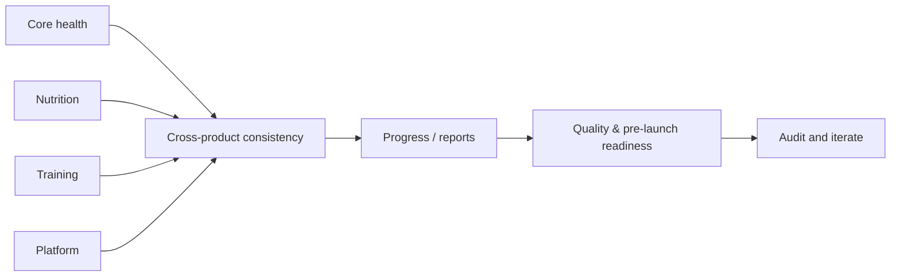
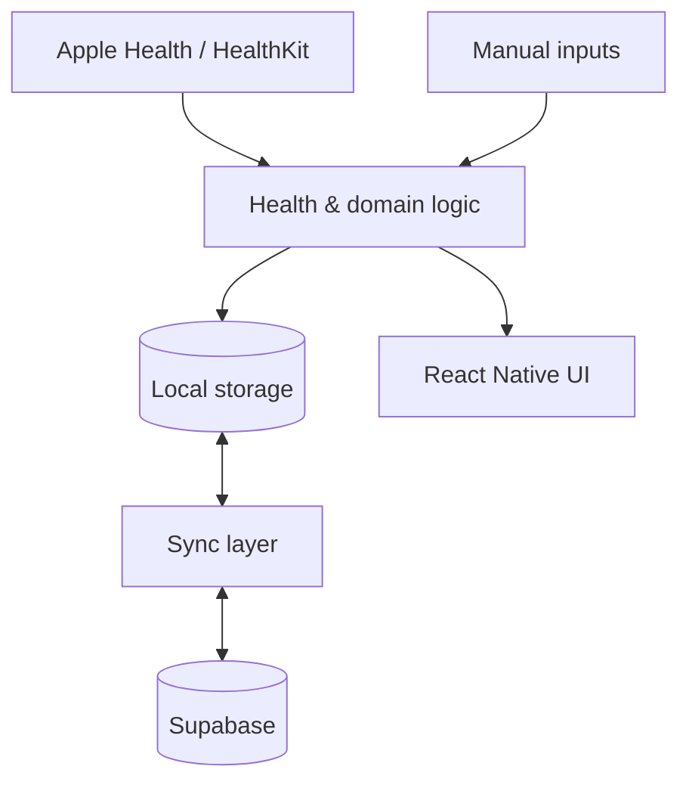
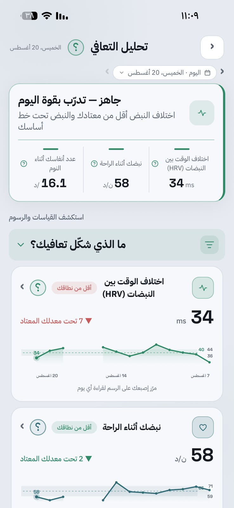
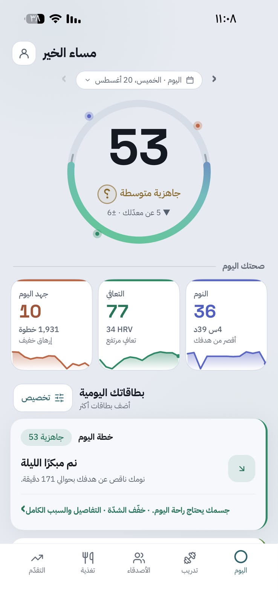
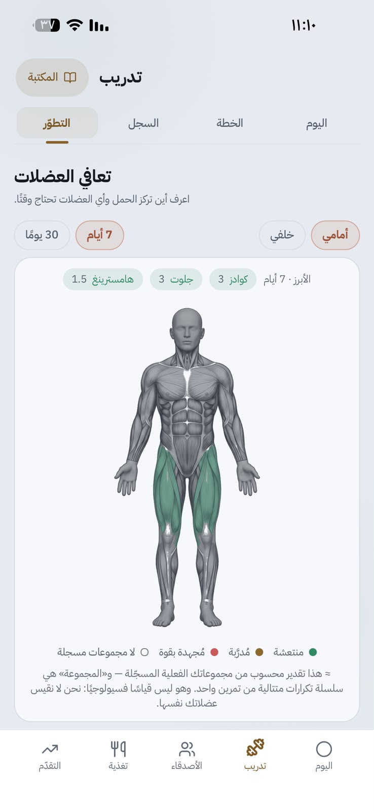
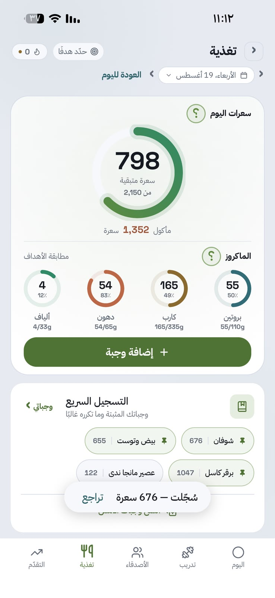
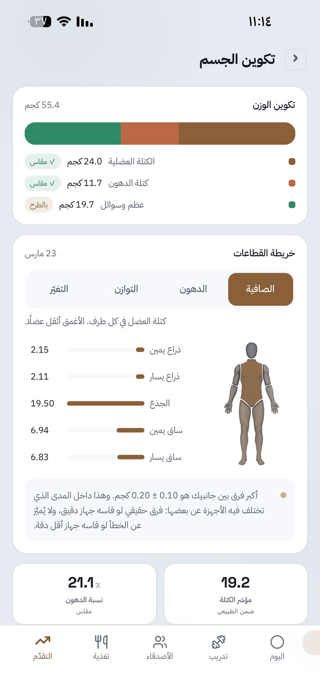

<div align="center">


# حالتي

### Arabic-first personal health platform for iOS

**Sleep · Recovery · Strain · Nutrition · Training · Progress — brought together in one daily experience**

`Pre-launch` · `React Native / Expo` · `HealthKit` · `Supabase` · `Arabic / English`

</div>

---

## Overview

**حالتي** is a personal health application designed around a simple product challenge: people often use separate tools for sleep/recovery, nutrition, workouts, and progress, then have to interpret the pieces themselves.

The product brings those areas into one experience built around three questions:

> **How am I today? Why? What should I do next?**

This repository is a public **product portfolio and case study** for the current pre-launch build.

---

## Product preview

<p align="center">
  
  &nbsp;&nbsp;
  
  &nbsp;&nbsp;
  
</p>

<p align="center"><sub>Selected screens from the current Arabic-first pre-launch build.</sub></p>

---

## Project evidence

The repository documents not only what the application contains, but also how problems were analyzed, decisions were made, and work was organized.

| Area | Evidence |
| --- | --- |
| **Requirements & process analysis** | problem framing, user needs, requirements, user stories, acceptance criteria, prioritization, traceability |
| **Planning & delivery** | scope breakdown, workstreams, dependencies, risks/issues, prioritization, iterative delivery |
| **Product decisions & prioritization** | alternatives, trade-offs, feature decisions, sequencing, review and iteration |
| **Product & UX thinking** | user flows, friction reduction, information hierarchy, Arabic-first interaction design |
| **Systems & technical context** | data flows, local/cloud boundaries, HealthKit integration, architecture documentation |
| **Testing & quality** | functional review, missing-data behavior, quality gates and release checks |

### Selected case studies and documentation

| Topic | Document |
| --- | --- |
| **Requirements & process analysis** | **[Nutrition logging case study →](docs/BUSINESS-ANALYSIS-CASE-STUDY.md)** |
| **Planning & delivery** | **[Project delivery case study →](docs/PROJECT-DELIVERY-CASE-STUDY.md)** |
| **Product decisions & trade-offs** | **[Decision case study →](docs/DECISION-CASE-STUDY.md)** |
| **Product & UX thinking** | **[Product & UX design →](docs/PRODUCT-DESIGN.md)** |
| **Systems & technical context** | **[System architecture →](docs/ARCHITECTURE.md)** |

---

## My contribution

My strongest direct contribution to حالتي is in **requirements, prioritization, UX review, testing, and coordinating decisions across the product**.

I have worked across the project by:

- turning broad ideas into clearer requirements and user flows;
- reviewing implemented screens and identifying usability or functional gaps;
- simplifying repeated workflows such as food and workout logging;
- deciding what belongs on a daily summary versus deeper analysis;
- comparing different product approaches before choosing an implementation direction;
- prioritizing improvements based on correctness, user value, and repeated-use friction;
- testing real flows and iterating when the result did not match the intended experience;
- shaping Arabic-first navigation, hierarchy, and terminology;
- keeping decisions consistent across health, nutrition, training, and progress areas.

**Implementation approach:** the application has been developed iteratively with AI-assisted coding. My strongest hands-on area is the **requirements, product experience, front-end review, and evaluation of the implemented result**.

---

## A concrete example: nutrition logging

A feature list does not show how a requirement was reached. The nutrition flow is one example of the analysis process.

**Problem:** food logging is repeated several times a day, so unnecessary steps create friction.

**Requirement:** allow users to select a food, choose **Serving Size × Quantity**, reuse frequent items, and confirm the transaction without repeating the full search path every time.

**Product response:** search + portion workflow + quick/recent/saved logging + barcode support + immediate daily-total updates.

```text
Problem
  → User need
  → Requirement
  → Priority
  → Flow
  → Implementation
  → Review / iteration
```

The full requirement set, acceptance criteria, prioritization, traceability, and validation targets are documented in the **[nutrition logging case study](docs/BUSINESS-ANALYSIS-CASE-STUDY.md)**.

---

## Product / UX approach

A recurring design decision is:

> **Keep the daily surface simple; place depth behind drill-down.**

| Level | User question | Experience |
| --- | --- | --- |
| **1** | How am I? | headline state and the most relevant next step |
| **2** | Why? | contributing measurements and context |
| **3** | What changed? | history, trends, and deeper analysis |

This structure is reused across sleep, recovery, strain, nutrition, and training so the product can support both a quick daily check and deeper inspection.

The alternatives and trade-offs behind this choice are documented in the **[decision case study](docs/DECISION-CASE-STUDY.md)**.

---

## Core product areas

| Area | Purpose |
| --- | --- |
| **Today** | turn multiple signals into one understandable daily state |
| **Sleep** | show sleep quality, duration, consistency, and deeper context |
| **Recovery** | interpret HRV, resting heart rate, sleep, and recent load against personal history |
| **Strain** | represent accumulated physical load separately from recovery |
| **Nutrition** | make food logging faster through search, barcode, saved meals, and quick repeat actions |
| **Training** | connect plans, sessions, progression, and muscle-recovery context |
| **Body & Progress** | track weight, body composition, goals, and longer-term changes |
| **Timeline & Reports** | connect planned activities with what actually happened and show trends over time |
| **Friends / Coaching** | support controlled sharing and contextual guidance |

---

## Planning & delivery

Because حالتي spans several domains, the work is organized as connected workstreams rather than one long feature list:



The **[project delivery case study](docs/PROJECT-DELIVERY-CASE-STUDY.md)** documents scope, priorities, dependencies, risks/issues, and an example iteration cycle.

---

## Selected technical context

The current application uses:

- **React Native / Expo** for the mobile application;
- **HealthKit** for supported Apple Health signals;
- **MMKV** for local-first persistence;
- **Supabase** for authentication, database, and cloud synchronization;
- **TypeScript** across the application;
- an Arabic/English interface with RTL/LTR support.

At a high level, the application separates health-data ingestion, domain logic, local storage, synchronization, and presentation.



Additional technical documentation is available without making the main portfolio page code-heavy:

| Topic | Document |
| --- | --- |
| Product and UX decisions | [Product & UX Design](docs/PRODUCT-DESIGN.md) |
| Application structure | [System Architecture](docs/ARCHITECTURE.md) |
| Backend and data model | [Backend & Data](docs/BACKEND-AND-DATA.md) |
| Selected scoring logic | [Core Algorithms](docs/CORE-ALGORITHMS.md) |
| Testing and quality checks | [Quality & Testing](docs/QUALITY-AND-TESTING.md) |
| High-level project structure | [Project Map](docs/PROJECT-MAP.md) |

---

## Current state

حالتي is an **active pre-launch personal project**. The current build includes working and evolving experiences across daily health, sleep, recovery, strain, nutrition, training, progress, reports, onboarding, and Apple Health integration.

The current focus is improving consistency, data reliability, and the experience of moving between the different health domains as one coherent product.

---

<details>
<summary><strong>View current-build screenshot gallery</strong></summary>

<br />

<p align="center">
  
  
  
</p>
<p align="center">
  
  
  
</p>
<p align="center">
  
  
  
</p>
<p align="center">
  
  
  
</p>

</details>
