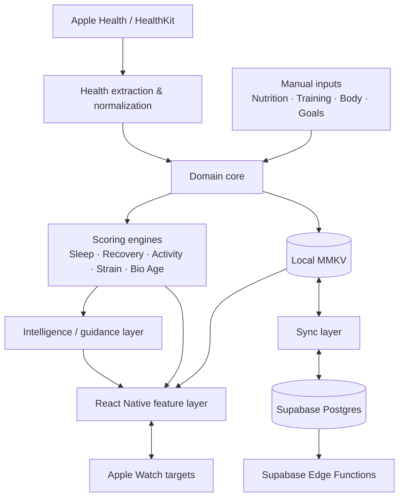
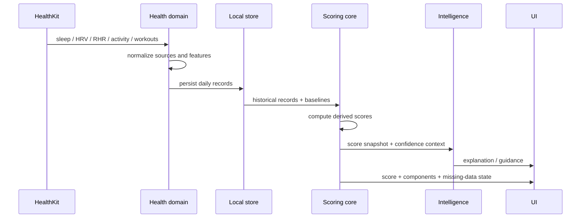
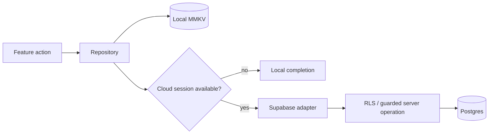

# System Architecture

This document summarizes the current high-level architecture of **حالتي** for technical review.

The application is iOS-focused and built with React Native / Expo, a local-first data model, Apple Health integration, domain scoring logic, and Supabase cloud services.

## Stack

| Layer | Current implementation |
| --- | --- |
| Mobile | Expo SDK 56 · React Native 0.85 · React 19 · TypeScript |
| Routing | Expo Router |
| Local state | Zustand |
| Local persistence | MMKV with native secure-key storage |
| Health data | Apple Health / HealthKit |
| Cloud | Supabase Postgres · Auth · Storage · Edge Functions |
| Observability | Sentry |
| Internationalization | i18next · Arabic/English · RTL-aware UI |
| Apple Watch | Native Swift targets + phone/watch data delivery |

## Architecture at a glance



## Why local-first

Daily interaction should not depend entirely on network availability.

A user action is persisted locally first, while cloud synchronization is handled as a separate concern. This supports:

- fast UI response;
- useful offline behavior;
- retries when cloud operations fail;
- clearer separation between product logic and cloud transport.

## Domain boundaries

The codebase is organized so domain rules are separated from screen components.

```text
src/
├── app/             routed screens
├── features/        screen-level hooks and feature UI
├── core/
│   ├── health/      HealthKit extraction and normalization
│   ├── scoring/     health score engines and baselines
│   ├── nutrition/   food, targets, meal workflows
│   ├── workouts/    plans, sessions, progression, fatigue
│   ├── body/        composition and progress logic
│   └── reports/     trends, summaries and export
├── data/            models, local persistence and cloud adapters
├── intelligence/    interpretation / recommendation layer
├── state/           Zustand stores
├── design2/ + ui2/  design tokens and shared UI primitives
├── i18n/            Arabic/English resources
└── server/          server-facing application helpers
```

The practical benefit is that a score, target, or domain rule can be reviewed and tested independently from a rendered screen.

## Health data flow



A key product rule is **missing is not zero**. If an input is unavailable, the experience can show a learning or insufficient-data state instead of inventing a value.

## Mobile ↔ cloud flow



The Supabase layer uses typed client boundaries, authenticated sessions, Row Level Security, and server-side functions where privileged operations are required.

## Apple Watch

The Watch experience is intentionally narrower than the phone application. Its primary use cases are daily-state visibility and training/session interaction.

The phone/watch boundary is designed around the possibility of delayed delivery rather than assuming permanent live connectivity.

## Architecture principles

1. **Domain logic outside UI** — screens consume domain contracts instead of redefining rules.
2. **Local-first interaction** — basic use should remain useful when the network is unavailable.
3. **Missing is not zero** — unavailable measurements remain unavailable.
4. **Personal baselines where appropriate** — recovery-related signals are interpreted against the user’s own history.
5. **Server-side privilege boundaries** — privileged operations stay outside the mobile bundle.
6. **Arabic is part of the product structure** — RTL, terminology, hierarchy, and search behavior are considered from the start.

## Related documents

- [Business Analysis Case Study](BUSINESS-ANALYSIS-CASE-STUDY.md)
- [Project Delivery Case Study](PROJECT-DELIVERY-CASE-STUDY.md)
- [Product & UX Design](PRODUCT-DESIGN.md)
- [Backend & Data](BACKEND-AND-DATA.md)
- [Core Algorithms](CORE-ALGORITHMS.md)
- [Quality & Testing](QUALITY-AND-TESTING.md)
