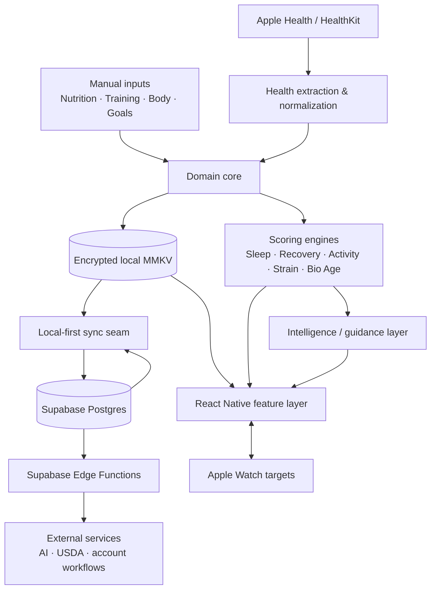
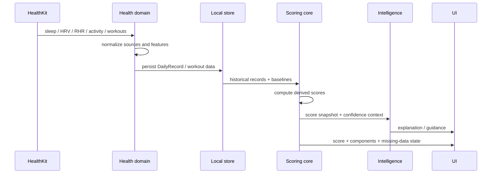
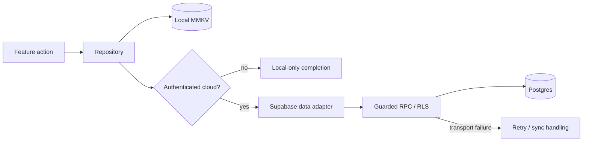

# System Architecture

This document describes the current high-level architecture of **Halaty** without exposing the private production repository.

The implementation is an iOS-focused React Native / Expo application with a local-first data model, Apple Health integration, domain scoring engines, and Supabase cloud services.

## Stack

| Layer | Current implementation |
| --- | --- |
| Mobile | Expo SDK 56 · React Native 0.85 · React 19 · TypeScript |
| Routing | Expo Router |
| Local state | Zustand |
| Local persistence | MMKV, with native secure-key storage |
| Health data | Apple Health / HealthKit |
| Cloud | Supabase Postgres · Auth · Storage · Edge Functions |
| Observability | Sentry |
| Internationalization | i18next · Arabic/English · RTL-aware UI |
| Apple Watch | Native Swift targets + phone/watch data delivery |

## Architecture at a glance



## Why local-first

The mobile experience is designed so that a network connection is not the primary source of truth for everyday interaction.

A user action is persisted locally first. Cloud synchronization is a secondary concern rather than a blocking dependency. This has several product and engineering benefits:

- fast UI response;
- useful offline behavior;
- health data remains available even during cloud outages;
- cloud failures can be retried without pretending the local action never happened;
- the app can keep cloud and product logic separated.

The current private implementation routes cloud-capable repositories through a Supabase data seam only when a configured Supabase session exists. Local/guest operation can continue without it.

## Domain boundaries

The private source is structured around domain logic rather than putting business rules inside screens.

```text
src/
├── app/             routed screens
├── features/        screen-level hooks and feature UI
├── core/
│   ├── health/      HealthKit extraction and normalization
│   ├── scoring/     health score engines and baselines
│   ├── nutrition/   food, targets, meal workflows
│   ├── workouts/    plans, sessions, progression, fatigue
│   ├── body/        composition and progress logic
│   └── reports/     trends, summaries and export
├── data/
│   ├── local        local persistence
│   ├── repositories repository abstraction
│   └── supabase/    typed cloud adapter
├── intelligence/    interpretation / recommendation layer
├── state/           Zustand stores
├── design/ + ui/    design tokens and primitives
└── i18n/            Arabic/English resources
```

The goal is that a score, target, or domain rule can be tested without rendering a React Native screen.

## Health data flow



A key rule is **no invented health values**. Missing inputs remain missing. The UI can display a learning/insufficient-data state instead of synthesizing a number.

## Mobile ↔ cloud flow

The current Supabase integration uses:

- a typed client based on generated database types;
- a publishable client key only — no service-role key in the app;
- persistent native auth sessions;
- Row Level Security for user-owned records;
- guarded server-side document write/delete RPCs for synchronized data;
- durable deletion tombstones and version-aware conflict handling;
- Edge Functions for operations that should not run with privileged secrets in the mobile client.



## Apple Watch

The project includes native Watch targets alongside the React Native application. The Watch experience is intentionally narrower than the phone app: daily state and training/session interactions are the primary use cases.

The phone/watch boundary is treated as a delivery problem rather than assuming live connectivity is always available. Commands and snapshots are designed to tolerate delayed delivery when appropriate.

## Architecture principles

1. **Domain logic outside UI.** Screens consume contracts; they do not redefine the scoring system.
2. **Local-first interaction.** Cloud availability should not determine whether basic app interactions work.
3. **Derived data is not raw data.** Health summaries can be surfaced without unnecessarily transporting raw sample streams.
4. **Missing is not zero.** An absent measurement is not silently converted into a valid value.
5. **Personal baselines before population norms.** Recovery-related metrics are interpreted against the user's own historical baseline where possible.
6. **Cloud privilege stays server-side.** Sensitive service credentials belong in server/Edge Function environments, not the iOS bundle.
7. **Arabic is architectural.** RTL, terminology, hierarchy, and search behavior are considered from the product structure—not applied as a translation pass.

## Private implementation references

For a technical reviewer discussing the project with me, the private implementation is organized around paths such as:

- `src/core/scoring/*`
- `src/core/health/*`
- `src/core/nutrition/*`
- `src/core/workouts/*`
- `src/data/repositories.ts`
- `src/data/supabase/*`
- `supabase/migrations/*`
- `supabase/functions/*`
- `targets/watch/*`

The production source remains private; this showcase exposes architecture and selected implementation logic without publishing credentials or the entire commercial codebase.
