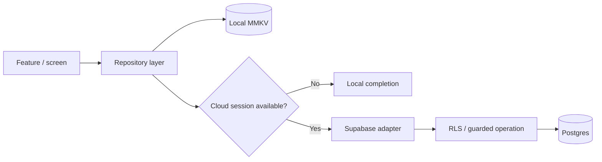
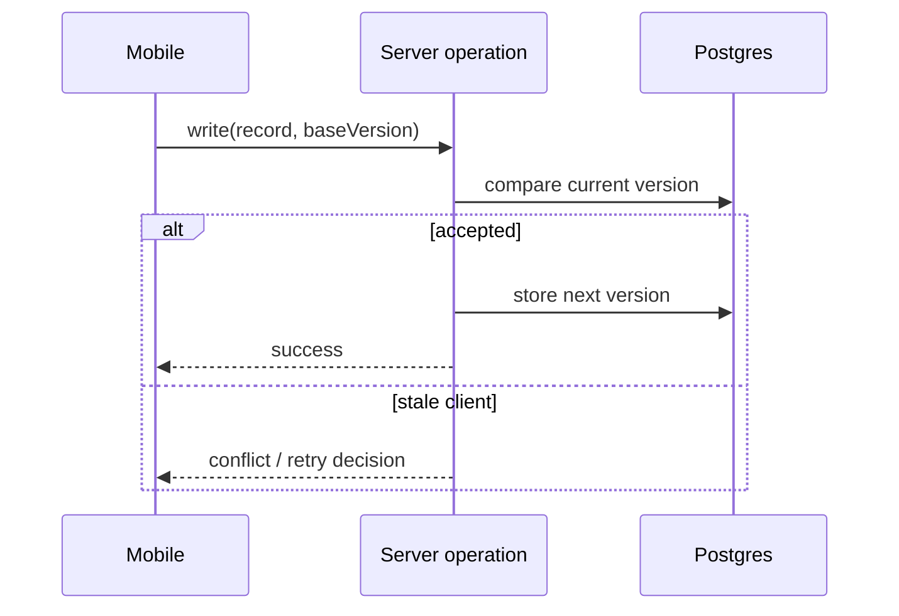
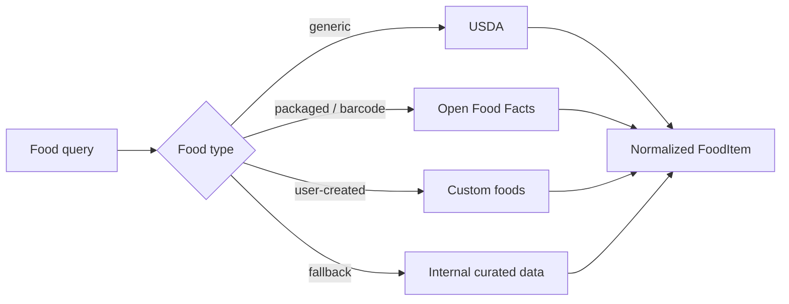

# Backend & Data Architecture

حالتي uses a **local-first mobile architecture** with Supabase as the cloud backend.

The design goal is straightforward: everyday interaction should remain responsive locally, while cloud services handle authentication, synchronization, and server-side operations where needed.

## Current backend stack

- **Supabase Auth** for authenticated identity
- **Supabase Postgres** for synchronized user data
- **Row Level Security (RLS)** for user-owned records
- **Supabase Storage** for supported file workflows
- **Supabase Edge Functions** for server-side operations
- **Generated TypeScript database types** for the mobile client
- **MMKV** for fast local persistence
- secure native key handling for protected local storage

## Local-first repository model

This separation allows the same product feature to support local use, temporary offline behavior, authenticated synchronization, and test scenarios without forcing every screen to depend directly on the backend.

## Authentication and client boundary

The mobile application uses a typed Supabase client and persistent native auth sessions.

Key implementation principles include:

- client-safe publishable credentials in the application;
- authenticated session persistence;
- automatic token refresh;
- PKCE-based native OAuth where required;
- privileged operations handled through server-side boundaries rather than the mobile client.

## Conflict-aware synchronization

Synchronized records can pass through guarded write logic instead of relying only on unconditional client-side overwrite behavior.

Conceptually:

The purpose is to reduce accidental overwrites when data may be updated from more than one state or device.

## Row Level Security

User-facing cloud records are protected with RLS policies so authentication alone does not imply unrestricted database access.

This is treated as a system requirement rather than only a UI concern because a correct-looking screen does not prove that backend authorization is correct.

## Edge Functions

Current server-side function areas include workflows such as:

| Function area | Purpose |
| --- | --- |
| AI gateway | route provider requests through a controlled server boundary |
| USDA search proxy | centralize external food-search integration |
| Account deletion | coordinate account/data cleanup |
| Shared snapshots | validate data before controlled sharing |

## Nutrition data sources

Nutrition uses more than one source because generic foods, packaged foods, and user-created foods have different data needs.

Source context and missing nutrition fields are handled explicitly where they affect reliability.

## Health-data boundary

Raw health samples and derived summaries are treated differently.

For many product surfaces, the useful output is a derived value such as a daily score, workout duration, heart-rate summary, or trend rather than an unnecessary copy of raw sample streams.

This separation supports clearer privacy and sharing boundaries.

## Local data protection

Persisted native data is designed to use device-protected key handling. If protected persistence is unavailable, the safer behavior is to avoid silently falling back to unprotected storage.

## Account deletion

Account deletion is treated as an end-to-end operation:

1. remove eligible cloud data;
2. complete the account-level backend operation;
3. clear local device state after the backend step succeeds.

## Why this matters for the product

These backend decisions are useful to the portfolio because they show how product requirements translate into system behavior:

- **offline usability** → local-first interaction;
- **multi-device consistency** → synchronization and conflict handling;
- **user privacy** → RLS and data boundaries;
- **food-data reliability** → multiple normalized sources;
- **account lifecycle** → coordinated deletion instead of only clearing the screen.

The focus of this document is the **system design and requirement-to-implementation relationship**, not backend code volume.
