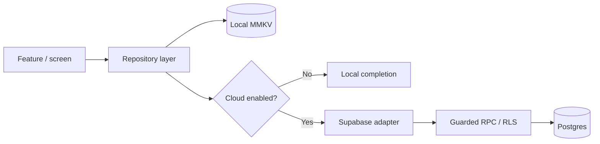
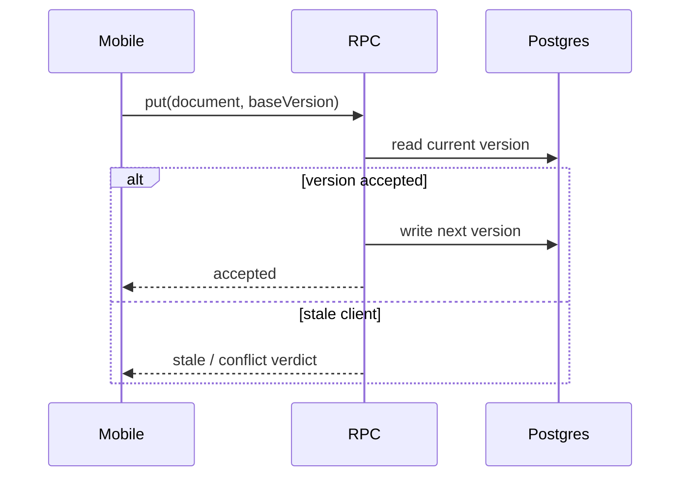
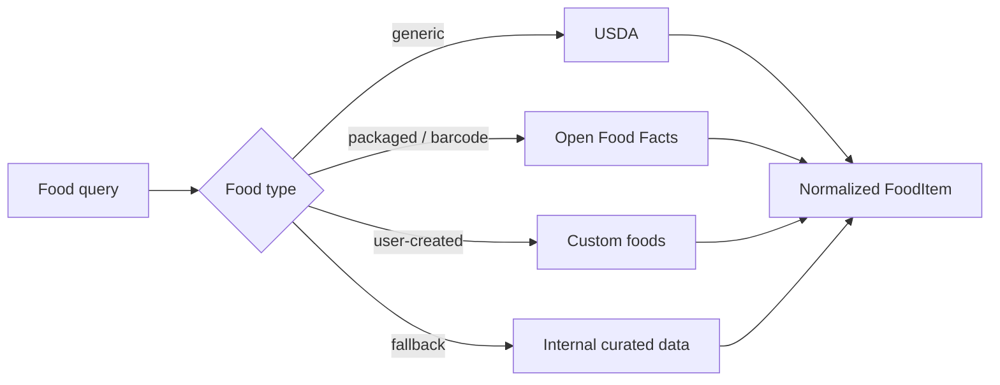

# Backend & Data Architecture

Halaty uses a **local-first mobile architecture** with Supabase as the current cloud backend.

The purpose of the cloud layer is not to make every screen dependent on a server round-trip. The mobile app keeps a local working copy and synchronizes eligible data to the cloud when an authenticated Supabase session is available.

## Current backend stack

- **Supabase Auth** for authenticated cloud identity
- **Supabase Postgres** for synchronized user data
- **Row Level Security (RLS)** for user-owned rows
- **Supabase Storage** for cloud file workflows where explicitly supported
- **Supabase Edge Functions** for privileged/server-side operations
- **Generated TypeScript database types** for the mobile client
- **MMKV** for fast local persistence
- **SecureStore-backed key handling** for native local-store protection

## Local-first repository model



The local write is the primary interaction path. The cloud copy is synchronized through a separate adapter.

That separation lets the same domain feature work in:

- authenticated cloud mode;
- temporary offline mode;
- guest/local-only mode;
- tests without a live backend.

## Supabase client boundary

The private mobile client creates a typed Supabase client only when the backend is configured.

Important constraints in the implementation:

- the app uses a **publishable/anon client key**, not a service-role key;
- auth sessions persist locally;
- token refresh is automatic;
- native OAuth uses PKCE where required;
- privileged operations are pushed to RPCs or Edge Functions.

Private source references:

```text
src/data/supabase/client.ts
src/data/supabase/config.ts
src/data/supabase/authBridge.ts
src/data/supabase/database.types.ts
```

## Conflict-aware writes

Synchronized document writes do not rely on an unconditional client-side upsert for all domain records.

The current backend adapter can route writes through guarded Postgres RPCs that compare a client's base version with the stored version.

Conceptually:



Deletes can create durable tombstone semantics so that a late write from another device does not casually resurrect data that has already been deleted.

This is implemented behind the repository/cloud seam rather than duplicated across feature screens.

Private source: `src/data/supabase/dataBackend.ts` and conflict-policy modules.

## Row Level Security

The cloud model is designed around the idea that mobile clients should not receive broad database privileges merely because the user is authenticated.

User-facing tables are protected with RLS policies and production smoke checks are part of the repository tooling.

The private codebase includes commands for:

```text
rules:check
rls:production-smoke
release:gate
```

The intention is to verify that schema/policy assumptions used by the app still match the deployed backend before release.

## Edge Functions

Current server-side function areas include workflows such as:

| Function area | Why server-side |
| --- | --- |
| AI gateway | keep provider secrets and request policy outside the mobile bundle |
| USDA search proxy | protect upstream credentials, centralize caching/rate handling |
| Account deletion | privileged account/data cleanup workflow |
| Shared snapshot publishing | validate and control externally visible user data |

Private paths include:

```text
supabase/functions/ai/
supabase/functions/usda-search/
supabase/functions/delete-account/
supabase/functions/publish-snapshots/
```

## Nutrition data sources

Nutrition combines multiple source classes because no single database is ideal for every food workflow.



The product tracks source/confidence metadata. Missing micronutrients are treated as unknown rather than automatically converted to zero.

## Health-data privacy boundary

Raw HealthKit streams and derived summaries are not treated as equivalent data.

The architecture prefers exposing derived values such as:

- daily scores;
- workout duration;
- average/max heart rate;
- trend summaries;

without unnecessarily publishing raw sample arrays or local-only file URIs to sharing/cloud surfaces.

This is especially important in report export and friend-sharing flows.

## Local data protection

On native builds, the app attempts to open the persisted MMKV store with a device-protected encryption key stored through the platform secure store.

A notable design decision is **fail closed** behavior: if the protected key is unavailable or the encrypted store cannot be opened safely, the intended fallback is non-persistent memory rather than silently persisting sensitive health data as plaintext.

## Account deletion

Account deletion is treated as a real backend operation rather than only clearing the local screen state.

The workflow separates:

1. user-owned cloud data cleanup;
2. privileged auth-account deletion;
3. local-device cleanup after the backend operation succeeds.

This matters because deleting the local cache alone would leave the user's cloud account and records behind.

## What is intentionally not public

This showcase does **not** publish:

- live database credentials;
- service-role secrets;
- production URLs that do not need to be public;
- the complete SQL schema/migration history;
- full authorization policies;
- production AI prompts or private business logic;
- private user data.

The goal is to show the engineering model without turning a portfolio repository into a security liability.
