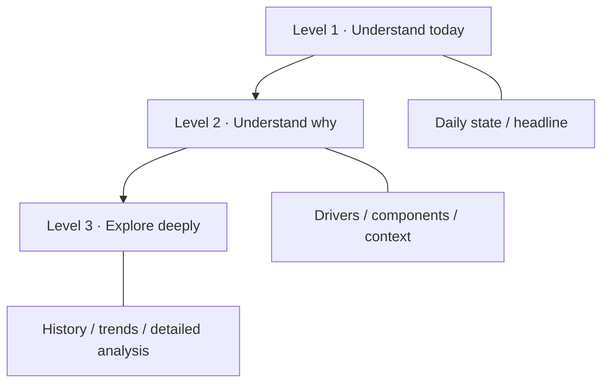
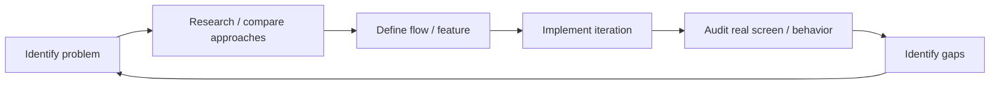

# Product & UX Design

حالتي is designed around one recurring user question:

> **How am I today, why, and what should I do next?**

The product challenge is not simply to show more health data. It is to make sleep, recovery, activity, nutrition, training, and progress feel like one coherent experience.

## Product thesis

Health-conscious users can already access many numbers. The problem is often fragmentation:

- wearable data in one place;
- food logging in another;
- workouts somewhere else;
- progress tracked separately;
- interpretation left to the user.

حالتي aims to connect those domains without turning the home experience into a dense analytics dashboard.

## Information architecture

The main design rule is:

> **Depth lives behind drill-down, never on the surface.**



This supports two different usage patterns:

- a user who wants a quick daily check;
- a user who wants to inspect HRV, sleep structure, trends, training load, nutrition, or progress in depth.

The alternatives and trade-offs behind this structure are documented in the **[Decision Case Study](DECISION-CASE-STUDY.md)**.

## Core user flows

### Daily health

```text
Today
  → score / status
  → why it changed
  → relevant driver
  → trend or full analysis
```

### Nutrition

```text
Nutrition home
  → Add meal
  → search / recent / saved / barcode / custom
  → serving × quantity
  → confirm
  → daily totals update
```

The UX goal is to reduce repeated logging friction without removing useful detail.

A full requirement-to-flow example is available in the **[Business Analysis Case Study](BUSINESS-ANALYSIS-CASE-STUDY.md)**.

### Training

```text
Training home
  → today's session / weekly plan
  → start workout
  → log sets
  → review session
  → progression / recovery context
```

Training is intentionally connected to recovery context rather than treated as a completely separate mini-product.

## Arabic-first design

Arabic support is not treated as a final translation task.

It affects:

- RTL hierarchy and directional controls;
- typography;
- terminology choices;
- number/unit presentation;
- date and calendar behavior;
- search behavior for Arabic food names;
- card alignment and visual scanning order;
- mixed Arabic/English values such as HRV and VO₂max.

The objective is for Arabic to feel native to the product structure rather than added after the interface is complete.

## Design-system approach

Reusable concepts include:

- cards;
- score rings;
- chips/status badges;
- metric rows;
- sparklines and trends;
- section headers;
- empty/learning states;
- bottom sheets;
- date navigation;
- typography and spacing tokens.

Shared patterns help sleep, recovery, nutrition, training, and progress feel like one product.

## Product principles

### 1. Simple first
The user should understand the main state before being asked to interpret detail.

### 2. Explain the number
A score is more useful when the user can understand the main drivers behind it.

### 3. Do not fake completeness
If a signal is unavailable, the interface should communicate that rather than render an invented zero or confident-looking substitute.

### 4. Progressive disclosure
Advanced information remains available, but appears after the user asks for it.

### 5. Reduce repeated work
Frequently repeated logging tasks should become faster through recent, saved, and shortcut patterns.

### 6. Keep domains connected
Nutrition, training, recovery, and progress should not behave like unrelated mini-products.

### 7. Treat privacy as part of the experience
Sharing features should make data categories and permissions explicit.

## Example: simplifying a dense health screen

A health score can have many useful supporting metrics.

Instead of placing everything on the first view:

```text
Screen 1
Score + status + one clear next step

        ↓ tap

Screen 2
Main drivers + relevant measurements

        ↓ drill down

Screen 3
History + trends + methodology/detail
```

The user is not denied depth; depth is placed where it can be understood.

## Example: data confidence

A large number can appear authoritative even when the underlying data is incomplete.

حالتي treats the following as distinct product states:

- enough data;
- learning a baseline;
- missing a signal;
- low-confidence context;
- estimated source;
- user-entered source.

The UI should communicate these states without making the experience feel broken.

## Product iteration workflow

The product has been developed iteratively rather than from a single frozen specification.



Recurring review questions include:

- Is this screen answering one clear question?
- What can be removed from the first view?
- What belongs behind a drill-down?
- Does Arabic feel native or merely translated?
- Is a missing value being presented honestly?
- Is the same concept implemented consistently in other domains?
- How many actions does a frequent user repeat every day?

## My contribution

My strongest direct contribution is in:

- product direction;
- feature definition and refinement;
- requirements and user flows;
- screen review;
- identifying friction and functional gaps;
- simplifying interactions;
- competitor/product comparison;
- prioritizing improvements;
- maintaining consistency across a broad product.

The implementation has been developed iteratively with AI-assisted coding, while my main hands-on focus is the product, front-end experience, requirements, and review of the implemented result.
