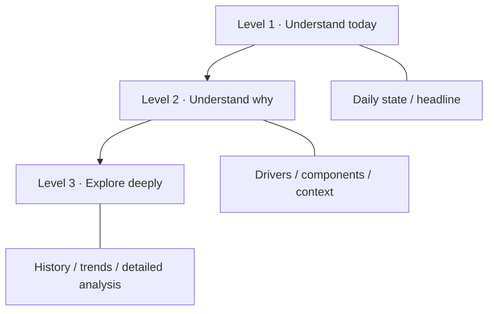
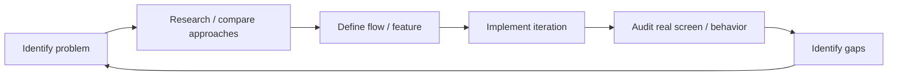

# Product & UX Design

Halaty is designed around one recurring user question:

> **How am I today, why, and what should I do next?**

The product challenge is not simply to show more health data. It is to make multiple domains—sleep, recovery, activity, nutrition, training, and progress—feel like one coherent experience.

## Product thesis

Most health-conscious users already have access to many numbers. The problem is fragmentation:

- wearable data lives in one place;
- food logging in another;
- workouts in another;
- progress and body metrics somewhere else;
- the user is left to interpret how the pieces relate.

Halaty's product direction is to connect these domains without making the home experience feel like a dense analytics dashboard.

## Information architecture

The main design rule is:

> **Depth lives behind drill-down, never on the surface.**



This lets the same product serve two very different usage patterns:

- someone who wants a 10-second daily check;
- someone who wants to inspect HRV, sleep structure, trends, training load, nutrition, or progress in depth.

## Core user flows

### Daily health

```text
Today
  → score / status
  → why it changed
  → relevant driver
  → trend or full analysis
```

### Nutrition

```text
Nutrition home
  → Add meal
  → search / recent / saved / barcode / custom
  → serving × quantity
  → confirm
  → daily totals update
```

The UX goal is to minimize repeated logging friction. Frequently used foods and meals should become faster over time rather than forcing the full workflow every time.

### Training

```text
Training home
  → today's session / weekly plan
  → start workout
  → log sets
  → review session
  → progression / recovery context
```

Training is not intended to be isolated from recovery. The product direction is that physical preparedness and training decisions should be visible in the same ecosystem.

## Arabic-first design

Arabic support is not treated as a final translation task.

It affects:

- RTL hierarchy and directional controls;
- typography;
- terminology choices;
- number/unit presentation;
- date and calendar behavior;
- search behavior for Arabic food names;
- card alignment and visual scanning order;
- mixed Arabic/English technical values such as HRV and VO₂max.

The private application uses dedicated Arabic/English resources and RTL-aware components rather than maintaining a separate Arabic application.

## Design-system approach

The implementation separates reusable visual primitives from feature-specific screens.

Typical reusable concepts include:

- cards;
- score rings;
- chips/status badges;
- metric rows;
- sparklines and trends;
- section headers;
- empty/learning states;
- bottom sheets;
- date navigation;
- typography and spacing tokens.

This matters in a large application because the product contains many domains. Without shared primitives, sleep, recovery, nutrition, and training quickly look like separate apps.

## Product principles

### 1. Simple first
The user should understand the main state before being asked to interpret detail.

### 2. Explain the number
A score without drivers is weak product communication. Where possible, a user can drill into the inputs or context behind a result.

### 3. Do not fake completeness
If a signal is unavailable, the interface should say that rather than rendering an invented zero or confident-looking substitute.

### 4. Progressive disclosure
Advanced information is valuable, but it should appear after the user asks for it.

### 5. Reduce repeated work
Logging experiences should learn from repeated actions through recent/saved patterns and shortcuts.

### 6. Keep domains connected
Nutrition, training, recovery, and progress should not behave like unrelated mini-products.

### 7. Privacy is part of UX
Friend/coach sharing requires explicit categories and permissions rather than assuming all health information is social.

## Example: turning a dense health screen into layers

A common product problem is that a health score can have too many useful supporting metrics.

Instead of showing everything on the first view:

```text
Screen 1
Score + status + one clear next step

        ↓ tap

Screen 2
Main drivers + relevant measurements

        ↓ drill down

Screen 3
History + trends + methodology/detail
```

The user is not denied depth; depth is simply placed where it can be understood.

## Example: data confidence in the interface

A health app can appear authoritative simply because a number is rendered in large type.

Halaty treats the following as product states:

- enough data;
- learning a baseline;
- missing a signal;
- low-confidence context;
- estimated source;
- user-entered source.

The UI should communicate these states without making the experience feel broken.

## Product iteration workflow

The product has been developed iteratively rather than from a single frozen specification.

The practical loop is:



Examples of recurring review questions:

- Is this screen answering one clear question?
- What can be removed from the first view?
- What belongs behind a drill-down?
- Does Arabic feel native or merely translated?
- Is a missing value being presented honestly?
- Is the same concept implemented consistently in other domains?
- How many taps does the frequent user repeat every day?

## Visual showcase

The repository keeps the full screenshot set under `assets/screenshots/`.

The main README intentionally shows only a small preview. The rest of the screenshots are available in a collapsible gallery so the visual layer supports the case study instead of overwhelming the technical/product narrative.

## My contribution

My strongest hands-on contribution is in:

- product direction;
- feature definition and refinement;
- UX flows;
- screen review;
- identifying friction and functional gaps;
- simplifying interactions;
- competitor/product comparison;
- prioritizing improvements;
- maintaining consistency across a broad product.

The technical architecture is documented in this portfolio because it is part of the real application, but the portfolio does not misrepresent my personal role as backend engineering expertise.
