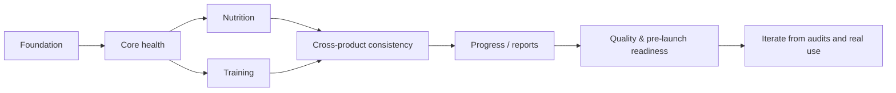

# Project Delivery Case Study — حالتي

This case study presents **حالتي** from a project-delivery perspective: scope, workstreams, prioritization, dependencies, risks, and iterative delivery.

## Project context

حالتي is an independent pre-launch mobile product that combines several health-related domains in one application. Because the product is broad, the main delivery challenge is not only building features; it is deciding **what to build first, what depends on what, and how to keep multiple workstreams coherent**.

## Objective

Build an Arabic-first iOS health experience that can bring together:

- daily health signals;
- sleep and recovery;
- nutrition logging;
- training and workout tracking;
- body/progress tracking;
- timelines, reports, and selected social/coaching flows.

## Scope view

### In scope

- iOS-first mobile experience;
- Apple Health / HealthKit integration;
- local-first daily use;
- cloud synchronization through Supabase;
- Arabic/English experience;
- nutrition, training, sleep/recovery, and progress workflows;
- pre-launch quality and release checks.

### Not treated as a launch prerequisite

- every possible health metric;
- every social/community feature;
- full parity with every specialist competitor;
- expanding to additional platforms before the core experience is coherent.

This distinction is important because breadth can easily become uncontrolled scope.

## Workstreams

| Workstream | Delivery focus |
| --- | --- |
| **Core health** | HealthKit data, daily state, sleep, recovery, strain |
| **Nutrition** | search, serving/quantity, quick logging, barcode, daily totals |
| **Training** | plans, sessions, logging, progression, muscle-recovery context |
| **Progress** | goals, body composition, trends, timeline/reporting |
| **Experience** | Arabic-first hierarchy, navigation, reusable patterns, consistency |
| **Platform** | local storage, Supabase sync, authentication, quality/release checks |

## Prioritization approach

Work is prioritized using a simple severity/value model:

- **P0 — blocks trust or a core transaction**  
  Example: incorrect totals, broken navigation, missing critical data state, or a logging flow that cannot complete.

- **P1 — materially improves the main experience**  
  Example: reducing repeated steps, improving analysis clarity, or connecting related product areas.

- **P2 — useful enhancement**  
  Example: additional presentation options or lower-frequency convenience features.

This keeps visual polish from outranking correctness and core usability.

## Delivery sequence



The sequence is not completely linear. Mature workstreams continue to be audited while other areas are developed.

## Example delivery cycle

A common cycle in the project is:

```text
Observe a problem
→ define the desired behavior
→ prioritize it
→ implement an iteration
→ review the real screen / flow
→ identify gaps
→ refine
```

### Example: nutrition logging

**Observation:** repeated meal entry required too much repeated interaction.  
**Priority:** high, because food logging is a frequent core action.  
**Change:** introduce faster repeat paths and make serving × quantity explicit.  
**Review:** inspect the resulting screen and transaction rather than treating implementation as completion.  
**Next step:** continue refining data quality and lower-frequency nutrition details after the core logging path is reliable.

See the detailed **[Business Analysis Case Study](BUSINESS-ANALYSIS-CASE-STUDY.md)**.

## Dependencies

| Dependency | Why it matters | Delivery response |
| --- | --- | --- |
| Apple Health / HealthKit | Core health signals depend on device data availability | support missing/learning states rather than assuming complete data |
| Supabase | Authentication and cloud synchronization | keep daily interaction local-first so cloud availability is not the only path |
| Food data sources | Search/barcode quality varies by source | normalize sources and keep source context where useful |
| Expo / EAS | Native build and release workflow | maintain explicit build/release checks |
| Apple Watch | Delivery can be delayed or disconnected | keep watch scope focused and tolerate delayed delivery where appropriate |

## RAID-style view

| Type | Example | Response |
| --- | --- | --- |
| **Risk** | Broad product scope creates inconsistent experiences | shared UX rules and cross-domain audits |
| **Risk** | Health data can be incomplete | explicit missing-data and confidence states |
| **Risk** | External food data can be inconsistent | source-aware normalization and validation |
| **Issue** | Repeated logging friction | quick/recent/saved logging paths |
| **Issue** | Dense health screens become difficult to scan | progressive disclosure and drill-down |
| **Dependency** | Backend availability | local-first interaction and later synchronization |

## Change management example

One recurring change pattern is moving detail away from the first screen without deleting it.

Initial versions of complex health areas can become crowded as useful measurements are added. Rather than continuing to add cards to the first view, the product uses a three-level structure:

1. **How am I?**
2. **Why?**
3. **What changed?**

That decision changed several screens and required consistency across related workstreams rather than a one-screen redesign.

See **[Decision Case Study](DECISION-CASE-STUDY.md)**.

## Delivery evidence

The repository provides multiple forms of evidence rather than a single feature list:

- current-build screenshots;
- product and UX flows;
- requirement/acceptance-criteria examples;
- architecture and data-flow diagrams;
- selected scoring logic;
- testing/release documentation;
- project decisions and trade-offs.

## What this case demonstrates

This case demonstrates:

- scope breakdown;
- workstream organization;
- prioritization;
- dependency awareness;
- risk/issue thinking;
- iterative delivery;
- cross-domain coordination;
- translating product needs into concrete UX and technical work;
- review of outcomes rather than only task completion.

The focus is on the **planning and delivery decisions used to move a broad independent product from idea to a working pre-launch build**.
